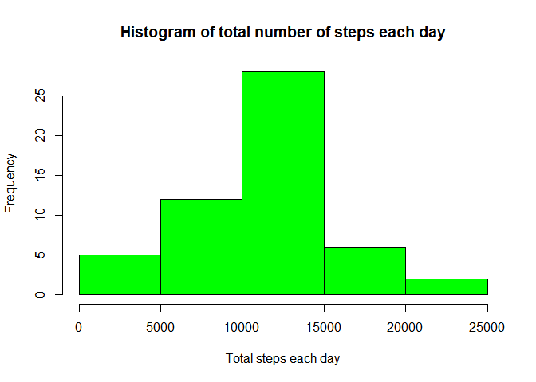
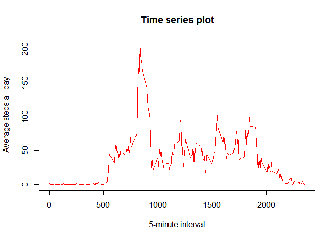
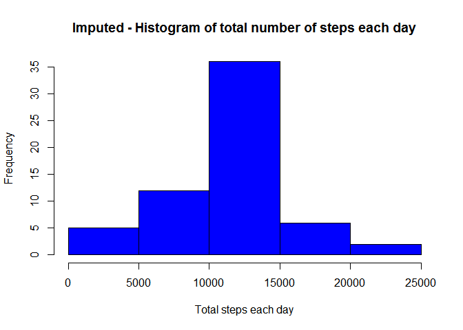
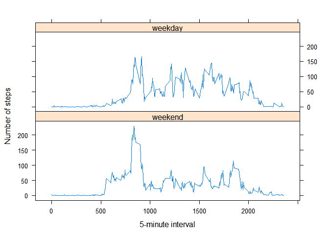

# Reproducible Research: Peer Assessment 1


## Loading and preprocessing the data

```r
dataset<-read.csv("activity.csv")
```

This dataset has only three variables (steps, date, and interval). We need to create descriptive variables to avoid confusion between date as variable date function. The processing that needs to be done is format the columns date and interval repectively as dates and numbers.


```r
names(dataset)<-c("numberofsteps", "datemeasurements", "fivemininterval")
```


## What is mean total number of steps taken per day?

```r
#ignore NA values...
data<-filter(dataset, !is.na(numberofsteps))

## 1. Calculate the total number of steps taken per day
totalstepsdaily <- aggregate(numberofsteps ~ datemeasurements, data, sum)

## 2. Make a histogram of the total number of steps taken each day;

hist(totalstepsdaily$numberofsteps, xlab = "Total steps each day", main ="Histogram of total number of steps each day", col="green")
```

<!-- -->

```r
## 3. Calculate and report the mean and median of the total number of steps taken per day
meansteps<-mean(totalstepsdaily$numberofsteps)
mediansteps<-median(totalstepsdaily$numberofsteps)
```
The mean of the total number of steps taken is 10766.1 and the median is 10765.0.


## What is the average daily activity pattern?

```r
## 1. Make a time series plot

averagedaily<-aggregate(numberofsteps ~ fivemininterval, dataset, mean)

plot(averagedaily$fivemininterval, averagedaily$numberofsteps, col="red", 
     xlab ="5-minute interval", ylab = "Average steps all day", main=paste("Time series plot"), type="l" )
```

<!-- -->

```r
## 2. Which 5-minute interval, on average across all the days in the dataset, contains the maximum number of steps?
maxinterval<-select(averagedaily, fivemininterval, max=max(numberofsteps) )%>% top_n(1)
```

```
## Selecting by max
```

```r
names(maxinterval)<-c("interval", "maximumsteps")
maxinterval
```

```
##   interval maximumsteps
## 1      835     206.1698
```
The 835 (5-min interval) contains the maximum number of steps on average accross all the day in the dataset.


## Imputing missing values

```r
## 1.Calculate and report the total number of missing values in the dataset.
missingvalues <- sum(is.na(dataset))
missingvalues
```

```
## [1] 2304
```

```r
reportmissingvalues<-paste("The sum of missing values for the entire dataset is",missingvalues)
reportmissingvalues
```

```
## [1] "The sum of missing values for the entire dataset is 2304"
```

```r
## 2.Strategy for filling in all of the missing values in the dataset.
print("My strategy is to imput the mean for 5-min interval.To avoid altering the original data, there is a need to create one dataset One for mean imputation and loop thru it.")
```

```
## [1] "My strategy is to imput the mean for 5-min interval.To avoid altering the original data, there is a need to create one dataset One for mean imputation and loop thru it."
```

```r
dataforMean<-dataset

## Mean imputation
for (i in 1:nrow(dataforMean)) {
  if(is.na(dataforMean$numberofsteps[i])){
    imputedvalue <- averagedaily$numberofsteps[which(averagedaily$fivemininterval == dataforMean$fivemininterval[i])]
        dataforMean$numberofsteps[i] <- imputedvalue 
        }
  }


## 3.Create a new dataset that is equal to the original dataset but with the missing data filled in.
newdataset<-dataforMean


## 4. Histogram, report mean and median

newtotalstepsdaily <- aggregate(numberofsteps ~ datemeasurements, newdataset, sum)
## Histogram
hist(newtotalstepsdaily$numberofsteps, xlab = "Total steps each day", main ="Imputed - Histogram of total number of steps each day", col="blue")
```

<!-- -->

```r
## Means and Medians
newmeanstepsdaily<-mean(newtotalstepsdaily$numberofsteps)
newmeanstepsdaily
```

```
## [1] 10766.19
```

```r
newmedianstepsdaily<-median(newtotalstepsdaily$numberofsteps)
newmedianstepsdaily
```

```
## [1] 10766.19
```
The mean total number of step taken per day is 10766.19 and the median is also 10766.19. The mean and median of the new dataset are both equal to the mean of the old dataset. The is no noticeable impact in imputing missing data.

## Are there differences in activity patterns between weekdays and weekends?

```r
## 1. Create weekday and weekend

## Format the data accordingly
newdataset$datemeasurements <- as.Date(newdataset$datemeasurements, "%Y-%m-%d")

## add a column for day of the week
newdataset$day<-weekdays(newdataset$datemeasurements)

## Extract saturday or sunday and assign to weekend
weekend<-sqldf("SELECT * FROM newdataset WHERE day='Saturday' OR day='Sunday' ")
```

```
## Loading required package: tcltk
```

```r
## Anything that is not saturday and sunday is a weekday
weekday<-sqldf("SELECT * FROM newdataset WHERE day!='Saturday' AND day!='Sunday' ")

## Aggregate weekend data
averageweekend<-aggregate(numberofsteps ~ fivemininterval, weekend, mean)

## factor variable for weekend
averageweekend$level<-c("weekend")

## Agregate weekdays data
averageweekday<-aggregate(numberofsteps ~ fivemininterval, weekday, mean)

## factor variable for weekdays
averageweekday$level<-c("weekday")

## combine the weekday and weekend datasets into one named allweek.
allweek<-rbind(averageweekday, averageweekend)

## Create a fctor variable f to be used for panel plot
f<-factor(allweek$level, labels = c("weekend", "weekday"))

## plot the data based on allweek dataset
xyplot(numberofsteps~fivemininterval|f, data=allweek, type="l", layout=c(1,2), xlab = "5-minute interval", ylab = "Number of steps")
```

<!-- -->

There is difference between the two graphs. We see that at early stages, the participation is more or less the same but it increases rapidely during weekday. 
